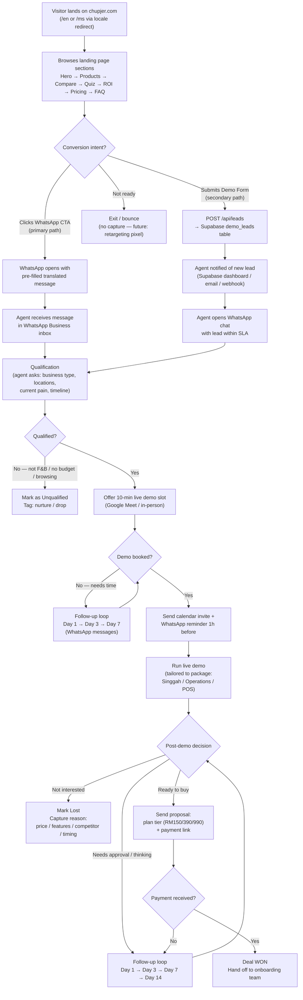

# Chupjer Web — CRM Flow Mockup

> **Internal document — do not publish.** Last updated: 2026-09-27.
>
> This mockup describes the end-to-end customer journey: from a first-time
> visitor landing on chupjer.com, through conversion (WhatsApp or demo form),
> to the lead being handled by a human sales agent until the deal is won or lost.

## Journey Overview

## Stage-by-Stage Breakdown

### Stage 1 — Visit & Discover (Automated)

| Aspect | Detail |
|---|---|
| **Entry points** | Google search (SEO/hreflang), direct, Threads social link, word of mouth |
| **System behaviour** | Middleware resolves locale (`NEXT_LOCALE` cookie → Accept-Language → `/en`); both `/en` and `/ms` are statically rendered |
| **Visitor actions** | Scrolls Hero → ProductDeck (3 packages) → ComparisonMatrix → FindYourMatch quiz → RoiCalculator → WhyChupjer → Testimonials → Pricing → FAQ |
| **Intent signals** | Completing the quiz (package recommendation shown), using the ROI calculator, dwelling on Pricing, expanding FAQ items |
| **Data captured** | None yet (anonymous). No account creation at any point in this flow |

### Stage 2 — Conversion (Two Paths)

**Path A — WhatsApp CTA (primary, lowest friction)**

| Aspect | Detail |
|---|---|
| **Trigger** | Any "Book a 10-Min Live Demo" / "WhatsApp" button, sticky mobile bar, per-package CTAs |
| **Mechanism** | `wa.me/60175916783?text=...` deep link with a pre-filled, locale-matched message (e.g. tier-aware message from Pricing: "I'm interested in the Multi-Location plan") |
| **Data carried over** | Package/tier interest embedded in the pre-filled text, language implied by the message |
| **Landing point** | Agent's WhatsApp Business inbox |

**Path B — Demo Request Form (secondary)**

| Aspect | Detail |
|---|---|
| **Trigger** | `LeadForm` in the DemoCTA section |
| **Mechanism** | `POST /api/leads` → validates name, business name, phone (min 9 digits, normalised to `+60...`) → inserts into Supabase `demo_leads` |
| **Data captured** | `name`, `business_name`, `phone`, `email?`, `package_interest?`, `locations?`, `source: "website-demo-form"`, `created_at`, locale (from `NEXT_LOCALE` cookie) |
| **Fallback** | If Supabase env vars are missing, the lead is accepted but only logged — **agents must watch the dashboard, not assume delivery** |
| **Confirmation** | Localised success message shown to visitor |

### Stage 3 — Agent Pickup & Qualification (Human)

| Aspect | Detail |
|---|---|
| **Owner** | Human sales agent monitoring WhatsApp Business + Supabase `demo_leads` |
| **SLA (target)** | WhatsApp: reply within 15 min (business hours). Form leads: first outreach within 2 hours |
| **First message (form leads)** | Personalised WhatsApp opener referencing the business name and package interest from the form |
| **Qualification checklist** | 1. Business type (kiosk / dine-in cafe / restaurant) 2. Number of locations (maps to plan tier) 3. Current pain (retention / peak-hour chaos / billing) 4. Timeline (now / this month / exploring) |
| **Language handling** | Agent replies in the lead's language (EN or MS), inferred from the pre-filled message or form locale |
| **Outcome** | Qualified → book demo. Unqualified → tag (`not-fnb`, `no-budget`, `just-browsing`) and park in a nurture list |

> **Suggested lead status values** (to be tracked in the CRM of choice — currently manual):
> `new` → `contacted` → `qualified` → `demo_booked` → `demo_done` → `proposal_sent` → `won` / `lost` (+ `nurture` for parked leads)

### Stage 4 — Demo Booking & Execution

| Aspect | Detail |
|---|---|
| **Booking** | Agent proposes 2–3 concrete slots over WhatsApp; confirms with a calendar invite link |
| **Reminder** | WhatsApp reminder 1 hour before the demo |
| **No-show handling** | Message within 30 min, offer one reschedule; second no-show → demote to nurture |
| **Demo content** | Tailored to the qualified package: Singgah (storefront + loyalty), Operations (QR dine-in + KOT), POS (counter + hardware). Use the same showcase screenshots featured on the site for continuity |
| **Goal of demo** | Confirm fit, surface objections, agree on plan tier (Cafe RM150 / Empayar RM390 / Franchise RM990) |

### Stage 5 — Proposal & Close (Won / Lost)

| Aspect | Detail |
|---|---|
| **Proposal** | Sent over WhatsApp: chosen tier, monthly price, applicable gateway fees (FPX/card/e-wallet/DuitNow/BNPL table), onboarding inclusion ("Free onboarding, same-day launch") |
| **Payment** | Payment link; deal counts as **won** only on payment receipt |
| **Won** | Mark `won`, record plan + MRR, hand off to onboarding (outside this flow's scope) |
| **Lost** | Mark `lost`, **always capture the reason**: `price`, `missing-feature`, `chose-competitor`, `bad-timing`, `no-response`. Lost reasons feed product/marketing decisions |
| **Cold / undecided** | Follow-up cadence: Day 1 → Day 3 → Day 7 → Day 14. After Day 14 with no response → `nurture` list for future campaigns |

## Lead Record (Data Model)

What the agent should hold per lead — maps directly to the existing `demo_leads` table plus status fields the CRM adds on top:

| Field | Source | Notes |
|---|---|---|
| `name`, `business_name`, `phone` | Form (required) | Phone normalised to `+60...`; WhatsApp leads supply this in chat |
| `email` | Form (optional) | |
| `package_interest` | Form / pre-filled WA message | `singgah` / `operations` / `pos` or plan tier |
| `locations` | Form / qualification chat | Drives plan recommendation (1 → Cafe, multi → Empayar, 10 → Franchise) |
| `source` | System | `website-demo-form` or `whatsapp-direct` |
| `locale` | Cookie / message language | `en` or `ms` |
| `status` | Agent | See status list in Stage 3 |
| `lost_reason` | Agent | Required when status = `lost` |
| `follow_up_count` | Agent | Caps the follow-up cadence |

## Gaps & Future Improvements

- **No CRM tool is wired in yet** — today the "CRM" is WhatsApp Business + the Supabase table. A lightweight CRM (or a simple status column + views in Supabase) would formalise statuses, follow-up counts, and lost reasons.
- **No lead notification** — agents must poll the `demo_leads` table. Add an email/webhook notification on insert (Supabase Database Webhooks → WhatsApp/email).
- **No retargeting** for the exit/bounce branch (no pixel/analytics events on quiz completion or ROI calculator usage).
- **No attribution** beyond `source: "website-demo-form"` — consider UTM capture in the form for ad-campaign tracking.
- **Auto-reply** on WhatsApp outside business hours would protect the 15-minute SLA expectation.
